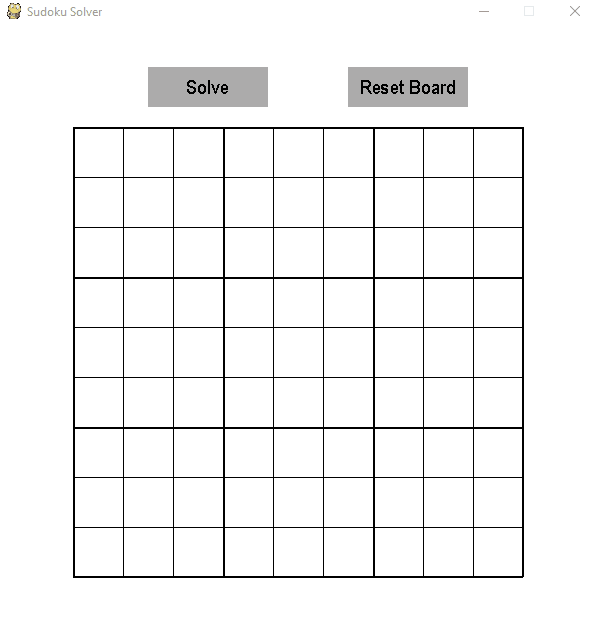

# Sudoku Solver

## Introduction
The goal of the project was to make an application where the user can input an unsolved Sudoku grid, and it would output the solution (if there is one).

The application solves the inputted Sudoku grid using a recursive backtracking algorithm (more info given under *Code Structure*). 

## Demo

## Controls
Numbers can be inputted directly into each grid square by left clicking the desired position (can change/override previously entered numbers).
To change a position back to being empty, simply input a 0.

The 'Solve' button will start the backtracking algorithm. 
    If there are less than 17 numbers entered in the grid, a pop-up box will be displayed prompting you to enter more.
    If an invalid board has been entered (not following the rules of Sudoku), a pop-up box will be displayed.
    
The 'Reset Board' button can be used to change the board back to its default state.

## Code Structure
The application mostly uses pygame for visuals, but also uses tkinter for pop-up boxes to prompt the user of any errors.

**SudokuGrid.py** - the main class used to handle all code corresponding to the game board. 
              - __sudokuSolver__() is the core function behind the backtracking algorithm to solve the sudoku board.
              
**App.py**        - used to structure the application window (user input, drawing the frame, updating the frame).

**Button.py**     - a simple class to create a button.

**Settings.py**   - used to store constants (i.e. dimensions of window, dimensions of game board, rgb colour values).
